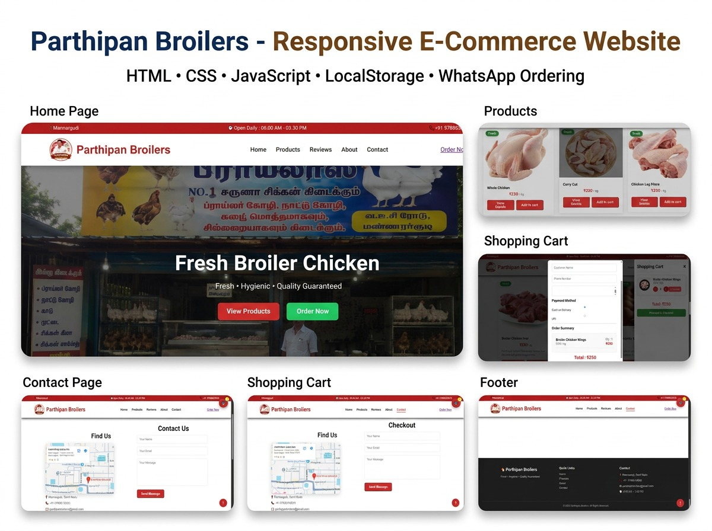

# 🐔 Parthipan Broilers - Mannargudi

<p align="center">


</p>

<p align="center">

</p>

---

# 🌐 Live Website

### 🔗 https://shaliniparthipan.github.io/Parthipan-Broilers/

---

# 📌 About Project

Parthipan Broilers is a responsive business website developed for a local broiler chicken shop located in Mannargudi.

The website allows customers to:

- 🛒 Browse Products
- ❤️ View Fresh Chicken Items
- 🛍 Add Products to Cart
- ➕ Increase / Decrease Quantity
- 📱 Order through WhatsApp
- 💳 Checkout Form
- 📍 View Shop Location
- 📞 Contact Shop Easily

---

# ✨ Features

✅ Responsive Design

✅ Product Search

✅ Product Categories

✅ Shopping Cart

✅ Quantity Management

✅ Local Storage Cart

✅ WhatsApp Checkout

✅ Contact Form

✅ Google Maps

✅ Scroll To Top Button

✅ Mobile Friendly

---

# 🛠 Technologies Used

- HTML5
- CSS3
- JavaScript
- Git
- GitHub
- GitHub Pages

---

>

```
# 📷 Screenshots

## Website Preview
    

```

---

# 📂 Project Structure

```
PB
│
├── css
├── js
├── images
├── icons
├── Screenshots
├── index.html
└── README.md
```

---

# 👩‍💻 Developed By

### Shalini P

💻 Aspiring Java Full Stack Developer

📍 Tamil Nadu, India

---

# ⭐ Support

If you like this project,

⭐ Please Star this Repository.

---

<p align="center">

Made with ❤️ using HTML • CSS • JavaScript

</p>